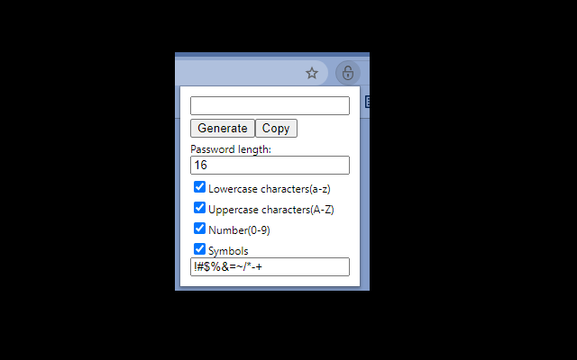

# Simple password generator for chrome extension

A Chrome extension that generates passwords with just one click.
This extension was created for the following purposes:

* Public and secure password generation algorithm.
* You can change the password settings to be generated according to the password policy of the website.

## Features

Generates a random string password. The password can be set as follows.

* Word length
* Lowercase characters(a-z)
* Uppercase characters(A-Z)
* Number(0-9)
* Symbols

Some websites do not allow symbols to be used in passwords. In that case, uncheck the symbol to generate a password that does not use the symbol.

## Screenshot

## Install

On Chrome, install via [Chrome web store](https://chrome.google.com/webstore/detail/icpkodanomclmhjgpgjmlnaphlgejbbb).
